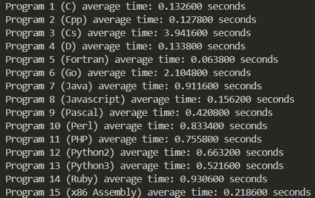

# Benchmarking
Program: 
Gauss-Jordan's Inverse Matrix

Programming Languages:
- C
- C++
- C#
- D
- Fortran
- Go
- Java
- Javascript
- Pascal
- Perl
- PHP
- Python 2
- Python 3
- Ruby
- x86 Assembly

Benchmarking result:
